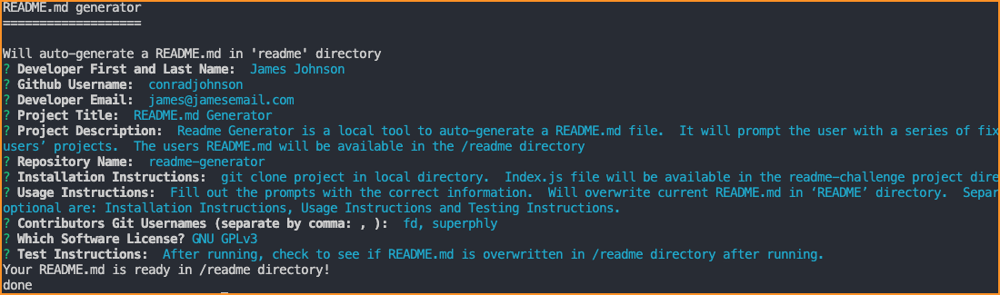

 
 

# README Generator

## Description

Readme Generator is a local tool to auto-generate a README.md file.  It will prompt the user with a series of fixed questions.  Based on those answers the tool will auto generate a README for the users’ projects.  The users README.md will be available in the /readme directory.

## Table of Contents

- [Demo and Screen Shots](#demo)
- [Installation](#installation)
- [Usage](#usage)
- [Testing](#testing)
- [Credits](#credits)
- [License](#license)
- [Questions](#questions)

## Demo
***

Demo:

Screen Shot:

## Installation
***

git clone project in local directory.  Index.js file will be available in the readme-challenge project directory.

## Usage
***

Fill out the prompts with the correct information.  Will overwrite current README.md in ‘README’ directory.  Separate contributors GitHub profile names with a comma ‘ , ’.    Sections that are optional are: Installation Instructions, Usage Instructions, Additional Contributors and Testing Instructions.

## Testing
***

After running, check to see if README.md is overwritten in /readme directory after running. 

## Credits
 ***

[conradjohnson](https://github.com/conradjohnson)

 ## License
 ***

  

  Mozilla Public License Version 2.0
  ==================================

  [http://mozilla.org/MPL/2.0/](http://mozilla.org/MPL/2.0/)
  
  
  Copyright (c) 2022 James Johnson
          

# Questions
***
For questions or assistance, please contact through [GitHub Account](https://github.com/conradjohnson).

 [Back to top](#description)